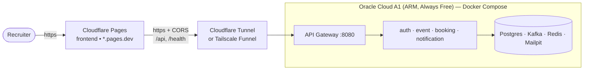

# Free 24/7 Deployment — Cloudflare Pages (frontend) + Oracle Cloud (backend)

A completely free way to keep a **clickable, always-on** demo link for your CV:

- **Frontend** → **Cloudflare Pages** (static, global CDN, HTTPS, effectively never
  down) — this is the URL you put on your CV.
- **Backend** → **Oracle Cloud Always Free** ARM VM (up to 4 OCPU / 24 GB RAM,
  *always* free) running the whole stack with Docker Compose.



> **Why this works when AWS free tier doesn't:** Oracle's Always Free ARM instance
> gives up to **24 GB RAM** — enough for the full stack 24/7. The images build
> natively for `arm64` on the VM (all base images, incl. **Mailpit**, support ARM).

---

## Part A — Backend on Oracle Cloud Always Free

1. **Create an Oracle Cloud account** (a credit card is required for verification;
   you are **not** charged while inside Always Free limits).
2. **Launch an Always-Free A1 instance**: Compute → Instances → Create.
   - Image: **Ubuntu 22.04**; Shape: **VM.Standard.A1.Flex**, e.g. **4 OCPU / 24 GB**.
   - Add your SSH public key.
   - *If you hit "Out of host capacity"* (common for free A1): retry, or change the
     Availability Domain / region. A retry loop over a few hours usually succeeds.
3. **Open the ports**: in the subnet's **Security List** allow ingress **80** and
   **443** (and **22** from your IP). Oracle Ubuntu images also have local iptables
   — open them too:
   ```bash
   sudo iptables -I INPUT -p tcp --dport 80 -j ACCEPT
   sudo iptables -I INPUT -p tcp --dport 443 -j ACCEPT
   sudo netfilter-persistent save
   ```
4. **Install Docker + Compose**:
   ```bash
   curl -fsSL https://get.docker.com | sudo sh
   sudo usermod -aG docker ubuntu && newgrp docker
   ```
5. **Run the stack** (builds arm64 images natively):
   ```bash
   git clone <your-repo> ticketflow && cd ticketflow
   export CORS_ALLOWED_ORIGINS="https://<your-project>.pages.dev"   # from Part B
   docker compose -f docker-compose.yml -f docker-compose.prod.yml up -d --build
   ```
   `docker-compose.prod.yml` adds `restart: unless-stopped` (survives reboots/crashes)
   and a JVM heap cap so 8 services share RAM.
6. **Expose the gateway over HTTPS** (pick one, both free):
   - **Cloudflare Tunnel** (recommended, needs a domain on Cloudflare — a `.dev`/`.xyz`
     is ~$1–10/yr and looks great on a CV):
     ```bash
     # install cloudflared, then:
     cloudflared tunnel login
     cloudflared tunnel create ticketflow
     # route api.yourdomain.com -> http://localhost:8080, then run:
     cloudflared tunnel run ticketflow
     ```
   - **Tailscale Funnel** (truly $0, no domain — gives a stable `*.ts.net` HTTPS URL):
     ```bash
     curl -fsSL https://tailscale.com/install.sh | sh
     sudo tailscale up
     sudo tailscale funnel 8080
     ```
   Note the resulting **HTTPS backend URL** (e.g. `https://api.yourdomain.com` or
   `https://<host>.<tailnet>.ts.net`) — you need it in Part B.

---

## Part B — Frontend on Cloudflare Pages

1. Cloudflare dashboard → **Workers & Pages → Create → Pages → Connect to Git**,
   select this repo.
2. Build settings:
   - **Root directory**: `frontend`
   - **Build command**: `npm run build`
   - **Output directory**: `dist`
3. **Environment variable**: `VITE_API_BASE_URL = https://<backend URL from Part A>`.
4. Deploy → you get **`https://<your-project>.pages.dev`** — the link for your CV.

The frontend calls the backend cross-origin; the gateway's CORS (set via
`CORS_ALLOWED_ORIGINS` in Part A) allows the Pages origin. `/api` and `/health`
both go to the gateway.

---

## Part C — Connect the two

- Backend `CORS_ALLOWED_ORIGINS` must equal your Pages URL (or `https://*.pages.dev`).
  After changing it: `docker compose -f docker-compose.yml -f docker-compose.prod.yml up -d api-gateway`.
- Frontend `VITE_API_BASE_URL` must equal your backend HTTPS URL (redeploy Pages if changed).

Verify:
```bash
curl -H "Origin: https://<your>.pages.dev" https://<backend>/api/events -i | grep -i access-control-allow-origin
```

---

## Cost & caveats (be honest in interviews)

| Item | Cost |
|---|---|
| Oracle A1 (4 OCPU / 24 GB) | **$0** (Always Free) |
| Cloudflare Pages | **$0** |
| Cloudflare Tunnel / Tailscale Funnel | **$0** |
| Domain (optional, recommended) | ~$1–10 / year |

**Caveats:** free A1 capacity can be hard to grab (retry/region); it's a single VM
(no HA — `restart: unless-stopped` covers crashes/reboots); Oracle requires a card
and can change Always-Free terms. For a CV demo this is perfectly adequate; for
anything mission-critical, use paid infra (see [INFRASTRUCTURE.md](INFRASTRUCTURE.md)).

**Safety:** set a **billing alert / budget** in Oracle and Cloudflare so an
accidental out-of-free-tier resource can never bill you silently.
