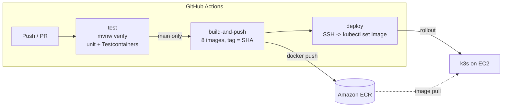
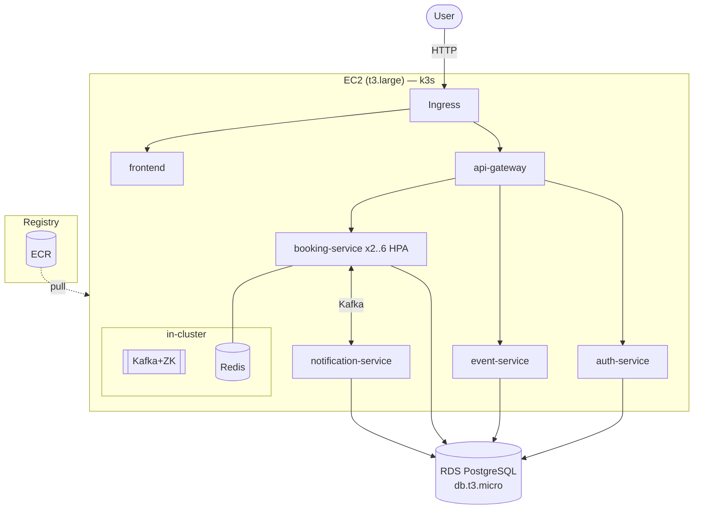

# Infrastructure & Deployment

How TicketFlow is built, shipped, and run — CI/CD, Kubernetes, and Terraform on
AWS, with an honest cost analysis and a genuinely-free option.

## Contents
- [CI/CD pipeline](#cicd-pipeline)
- [Deployment architecture](#deployment-architecture)
- [Kubernetes](#kubernetes)
- [Cost](#cost--and-how-to-keep-it-near-0)
- [Free alternatives](#free-alternatives)

---

## CI/CD pipeline

GitHub Actions ([`.github/workflows/ci-cd.yml`](.github/workflows/ci-cd.yml)).
Every PR runs the tests; merging to `main` builds images, pushes to ECR, and
rolls them out.



- **test** — `./mvnw verify` runs unit tests (Surefire) and integration tests
  (Failsafe + **Testcontainers**; GitHub runners provide Docker, so the real
  DB/Kafka integration tests actually run in CI).
- **build-and-push** — a matrix builds one image per service, tags it with the
  commit **SHA** (immutable) and `latest`, and pushes to **ECR**. Auth to AWS is
  via **GitHub OIDC** (an assumed IAM role — no long-lived keys in the repo).
- **deploy** — on `main`, SSHes to the k3s node and `kubectl set image` to the new
  SHA tag, then waits for the rollout. Trivially rolled back by re-deploying a
  previous SHA.

**Required GitHub config:** variable `AWS_REGION`; secrets `AWS_DEPLOY_ROLE_ARN`,
`ECR_REGISTRY`, `DEPLOY_HOST`, `DEPLOY_USER`, `DEPLOY_SSH_KEY`.

---

## Deployment architecture

Terraform ([`terraform/`](terraform/)) provisions the AWS footprint; the same
Kubernetes manifests ([`k8s/`](k8s/)) run on minikube, k3s, or EKS.



**Why EC2 + k3s instead of EKS:** EKS's control plane alone is ~$73/month — too
much for a demo that should run cheaply. k3s is fully-conformant Kubernetes on a
single VM, so the **same manifests** (Deployment/Service/ConfigMap/Secret/Ingress/HPA)
run unchanged — proving the Kubernetes skill without the EKS bill. RDS is managed
so the database survives cluster rebuilds.

---

## Kubernetes

[`k8s/`](k8s/) — Deployment + Service for all 8 services, a shared **ConfigMap**
and **Secret**, in-cluster Postgres/Kafka/Redis/MailHog, an **Ingress** (single
entry point), and an **HPA** that scales Booking Service 2→6 pods at 70% CPU.

Run it locally for **free** on minikube — see [`k8s/README.md`](k8s/README.md).

---

## Cost — and how to keep it near $0

Estimated monthly cost to run the full stack **24/7** in `us-east-1` (approx,
on-demand):

| Resource | Spec | ~ Monthly |
|---|---|---|
| EC2 (k3s node) | t3.large (8 GB) | ~$61 |
| — cheaper option | t3.medium (4 GB, trimmed subset) | ~$30 |
| RDS PostgreSQL | db.t3.micro, 20 GB | **free 12 mo**, then ~$15 |
| EBS root volume | 30 GB gp3 | ~$2.4 |
| ECR storage | ~2–4 GB of images | ~$0.30 |
| Data transfer out | first 100 GB free | ~$0 |
| **Total (full stack, 24/7)** | | **~$65/mo** (yr 1) |

**There is no free way to run this whole stack 24/7 on AWS** — it needs ~6–8 GB
RAM, and free-tier EC2 is 1 GB. So the IaC is designed for **apply → demo →
destroy**:

```bash
terraform apply     # spin up for a demo / screen recording
# ... record the live system ...
terraform destroy   # idle cost returns to ~$0
```

A few hours of demo time costs **well under $1**. This is itself a good interview
point: *infrastructure as code means I pay only for what I use, when I use it.*

---

## Free alternatives

| Option | Cost | Notes |
|---|---|---|
| **minikube** (local) | **$0** | Full stack on your machine using the same `k8s/` manifests. Best for development + a local demo. |
| **Oracle Cloud Always Free** | **$0 forever** | Ampere A1 ARM: up to **4 vCPU + 24 GB RAM always free** — enough to run the entire stack with k3s 24/7. Caveat: ARM, so rebuild images for `arm64` (the base images support it). The only genuinely-free way to host this live 24/7. |
| **AWS free tier (subset)** | ~$0 (12 mo) | Only a trimmed subset (gateway + 1–2 services + RDS) fits a t3.micro. |
| **AWS apply/destroy** | ~cents per demo | Full fidelity on real AWS, paid only while up. |

---

## What's in the repo

| Path | Purpose |
|---|---|
| [`.github/workflows/ci-cd.yml`](.github/workflows/ci-cd.yml) | CI/CD: test → build → ECR → deploy |
| [`k8s/`](k8s/) | Kubernetes manifests (minikube / k3s / EKS) |
| [`terraform/`](terraform/) | AWS: VPC, ECR, RDS, EC2 + k3s |
| [`docker-compose.yml`](docker-compose.yml) | Full local stack (dev) |
