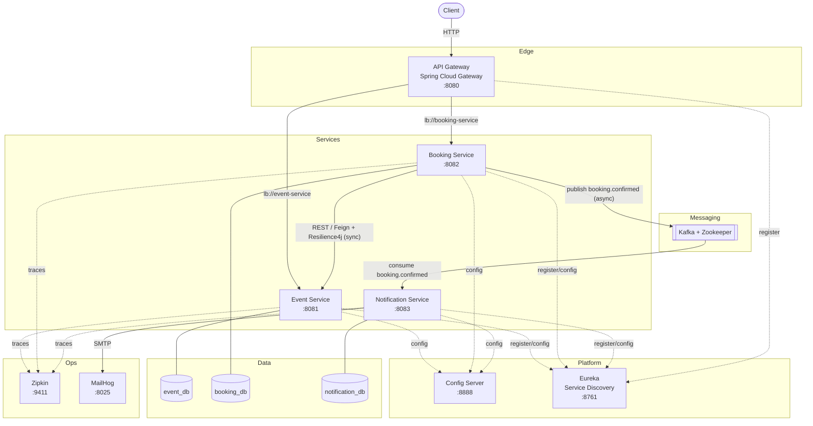
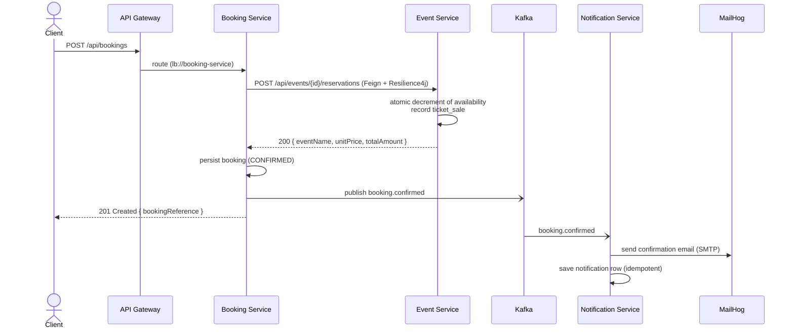

# TicketFlow — Event Ticketing Platform (Microservices)

A production-style **event ticketing platform** built with **Java 21 + Spring Boot 3 + Spring Cloud**, demonstrating a full microservices toolkit: an API gateway, service discovery, centralised configuration, **synchronous REST with circuit breaking** and **asynchronous event-driven messaging**, database-per-service, distributed tracing, structured logging, a Spring Batch reporting job, and containerised local deployment.

> Portfolio project. The goal is to show *how the pieces fit together* the way they would in a real system — not just that each one works in isolation.

---

## Architecture



### Booking flow (sync REST + async event)



If Event Service is **down or slow**, Resilience4j **retries**, then **opens the circuit** and Booking Service fails fast with **503** instead of hanging — see [Resilience](#resilience).

---

## Tech stack

| Concern | Choice |
|---|---|
| Language / runtime | Java 21 |
| Framework | Spring Boot 3.3, Spring Cloud 2023.0.x |
| Frontend | React 18 + Vite + Ant Design + React Query (Nginx) |
| Auth | JWT (jjwt) issued by Auth Service, verified at the gateway |
| API gateway | Spring Cloud Gateway |
| Service discovery | Netflix Eureka |
| Central config | Spring Cloud Config Server (native) |
| Sync comms | OpenFeign + **Resilience4j** (circuit breaker + retry) |
| Async comms | Apache Kafka (event-driven) |
| Persistence | PostgreSQL (one DB per service), **Flyway** migrations |
| Batch | Spring Batch (daily revenue report) |
| Tracing | Micrometer Tracing → **Zipkin** |
| Logging | Logback + **JSON** (logstash encoder), ready for ELK/Loki |
| API docs | springdoc-openapi (Swagger UI) |
| Email | Spring Mail → **MailHog** (local fake SMTP) |
| Testing | JUnit 5, Mockito, **Testcontainers**, EmbeddedKafka, GreenMail |
| Packaging | Multi-stage Docker builds, Docker Compose |

---

## Services & ports

| Service | Port | Notes |
|---|---|---|
| Frontend (React) | 3000 | Nginx-served SPA |
| API Gateway | 8080 | Single entry point; verifies JWT |
| Config Server | 8888 | Serves `backend/config-repo/` |
| Eureka | 8761 | Dashboard at `/` |
| Auth Service | 8084 | Register/login, issues JWT |
| Event Service | 8081 | Events, ticket inventory, batch report |
| Booking Service | 8082 | Bookings (Feign + Resilience4j + Kafka) |
| Notification Service | 8083 | Kafka consumer, sends email (no gateway route) |
| Zipkin | 9411 | Trace UI |
| MailHog | 8025 (UI), 1025 (SMTP) | Captured emails |
| Kafka | 9092 (host) | Broker |
| PostgreSQL | 5433 / 5434 / 5435 / 5436 | event / booking / notification / auth |

Useful URLs once running:
- **Frontend: <http://localhost:3000>**
- Eureka: <http://localhost:8761>
- Zipkin: <http://localhost:9411>
- MailHog: <http://localhost:8025>
- Swagger (Event): <http://localhost:8081/swagger-ui.html>
- Swagger (Booking): <http://localhost:8082/swagger-ui.html>

---

## Running it

### Option A — Docker Compose (everything, recommended)

Requires Docker Desktop.

```bash
docker compose up --build
```

This starts the frontend + 7 backend services plus Kafka + Zookeeper, four PostgreSQL databases, Zipkin and MailHog. Startup order is handled via healthchecks (`config-server → eureka → databases/kafka → services`). Give it a minute on first run (Maven builds inside the images). Then open <http://localhost:3000>.

Stop and wipe volumes:

```bash
docker compose down -v
```

### Option B — Run locally without Docker

Build the backend with the Maven wrapper (no local Maven needed):

```bash
cd backend && ./mvnw clean install
```

Create the databases in a local PostgreSQL (see [`backend/scripts/local-init-postgres.sql`](backend/scripts/local-init-postgres.sql)), then start each service in its own terminal, in order (from `backend/`):

```bash
java -jar infra-config-server/target/*.jar
java -jar infra-discovery-server/target/*.jar
java -jar api-gateway/target/*.jar
java -jar auth-service/target/*.jar
java -jar event-service/target/*.jar
java -jar booking-service/target/*.jar
java -jar notification-service/target/*.jar
```

Run the frontend dev server separately (proxies to the gateway, see `frontend/vite.config.js`):

```bash
cd frontend && npm install && npm run dev
```

Without a local Kafka/SMTP, Booking still works and simply logs that publishing failed; Notification records the email attempt as `FAILED`. Use Option A for the full event-driven flow.

---

## Try it (end-to-end)

The easiest way is the **frontend at <http://localhost:3000>**: register, browse events, book, watch the email land in MailHog, and check the health dashboard.

With `curl` (note bookings now require a JWT from the auth service):

```bash
# 1. Register (or login) to get a JWT
TOKEN=$(curl -s -X POST http://localhost:8080/api/auth/register \
  -H "Content-Type: application/json" \
  -d '{"email":"alice@example.com","password":"secret123","displayName":"Alice"}' \
  | sed -E 's/.*"token":"([^"]+)".*/\1/')

# 2. See the seeded events (public, no token needed)
curl http://localhost:8080/api/events

# 3. Create a booking (protected — gateway verifies the JWT)
curl -X POST http://localhost:8080/api/bookings \
  -H "Content-Type: application/json" -H "Authorization: Bearer $TOKEN" \
  -d '{"eventId":1,"customerName":"Alice","customerEmail":"alice@example.com","quantity":2}'

# 4. The confirmation email now appears in MailHog: open http://localhost:8025

# 5. Run the daily revenue Spring Batch job, then read the report
curl -X POST http://localhost:8081/api/events/reports/daily/run
curl http://localhost:8081/api/events/reports/daily
```

Open **Zipkin** (<http://localhost:9411>) to see a single trace span the gateway → booking → event call chain.

---

## Business flow

0. A user **registers/logs in** via **Auth Service**, receiving a **JWT**. The **gateway verifies** that token on protected routes (bookings) and forwards the user's email downstream as `X-User-Email`; browsing events is public.
1. **Events** are created and managed by **Event Service**, which owns ticket inventory and pricing.
2. A **booking** request hits the **gateway**, which routes it to **Booking Service**.
3. Booking Service calls Event Service over **REST (Feign)** to **reserve** tickets. Event Service performs an **atomic conditional update** so concurrent bookings can never oversell, and records a `ticket_sale`.
4. Booking Service persists the booking and **publishes `booking.confirmed`** to Kafka.
5. **Notification Service** consumes the event, **sends a confirmation email** (to MailHog locally) and stores a notification. Consumption is **idempotent** (unique booking reference), so Kafka's at-least-once delivery cannot send duplicates.
6. A nightly **Spring Batch** job in Event Service rolls up each day's `ticket_sales` into a `daily_event_sales_report` (per event). The job is idempotent — re-running a day replaces its rows.

### Why these boundaries?
- **Database per service** — no service reads another's database. Event Service records its own `ticket_sale` rows precisely so the batch report never needs to query Booking's data.
- **Sync vs async** — reserving tickets must be **consistent and immediate**, so it is a synchronous REST call. Notifying the customer is **eventually consistent**, so it is an asynchronous event. This is a deliberate, explained trade-off.
- **Thin shared module** — `common/` holds only the Kafka event contract and a shared error DTO. No shared entities or business logic, to avoid a distributed monolith.

---

## Resilience

The Booking → Event call is wrapped with Resilience4j (config in [`backend/config-repo/booking-service.yml`](backend/config-repo/booking-service.yml)):

- **Retry** — transient failures (connection refused, 5xx) are retried a few times.
- **Circuit breaker** — after repeated failures the circuit **opens** and calls fail fast (503) instead of piling up against a struggling dependency; it later probes **half-open** and **closes** on recovery.
- **Business vs infrastructure errors** — a 404 (event missing) or 409 (sold out) is a *business* outcome: it is **not** retried and is passed straight back to the client with the right status. Only infrastructure failures trip the breaker.

Circuit-breaker state is exposed at `http://localhost:8082/actuator/circuitbreakers`.

---

## Testing

```bash
cd backend
./mvnw test        # fast unit tests (Mockito, GreenMail) — no Docker
./mvnw verify      # + integration tests (Testcontainers, EmbeddedKafka) — needs Docker
```

- **Unit** — service logic with mocked collaborators.
- **Integration (`*IT`)** — Booking and Notification services spin up **real PostgreSQL via Testcontainers** and an **embedded Kafka broker** to verify the true persist/publish/consume paths.
- **Email** — `EmailSenderTest` uses **GreenMail** (in-JVM SMTP) to prove real email sending without Docker.

---

## Project structure

```
ticketflow/
├── docker-compose.yml       # orchestrates the whole stack (backend + frontend)
├── .env / .env.local.example
├── backend/                 # Spring Boot microservices (multi-module Maven)
│   ├── pom.xml              #   reactor
│   ├── common/              #   thin shared module: Kafka event contract + error DTO
│   ├── config-repo/         #   centralised config served by Config Server
│   ├── infra-config-server/ #   Spring Cloud Config Server
│   ├── infra-discovery-server/  # Eureka
│   ├── api-gateway/         #   Spring Cloud Gateway (verifies JWT)
│   ├── auth-service/        #   register/login, issues JWT
│   ├── event-service/       #   events, inventory, Spring Batch report
│   ├── booking-service/     #   bookings: Feign + Resilience4j + Kafka producer
│   ├── notification-service/#   Kafka consumer → email + notification store
│   ├── scripts/             #   local DB bootstrap
│   └── mvnw                 #   Maven wrapper
└── frontend/                # React + Vite + Ant Design SPA (Nginx in Docker)
    ├── src/ (pages, api, auth)
    ├── nginx.conf           #   proxies /api → gateway, /health/* → services
    └── Dockerfile
```

---

## Production considerations (deliberately out of scope here)

These are called out to show awareness rather than implemented:

- **Saga / compensation** — if a reservation succeeds but the booking fails to persist, tickets could be left reserved. A real system would release them via a compensating action or an outbox + saga.
- **Transactional outbox** — publishing to Kafka after a DB commit risks a lost event on crash; an outbox pattern makes it atomic.
- **Separate repos & pipelines** — in production each service would have its own repository and CI/CD; a mono-repo is used here for reviewability.
- **Secrets** — the committed `.env` holds dev-only defaults; all secrets (`JWT_SECRET`, `DB_PASSWORD`, SMTP creds) are overridable via the deploy environment (`.env.example` documents them, mail lives in git-ignored `.env.local`). A public deploy MUST set a strong `JWT_SECRET`. Production would go further with a real secrets manager and encrypted config-server backend.
- **Auth scoping** — bookings are tied to the authenticated user: the gateway verifies the JWT and forwards `X-User-Email`, and Booking Service scopes all reads to that user (you can only list/fetch your own bookings).
